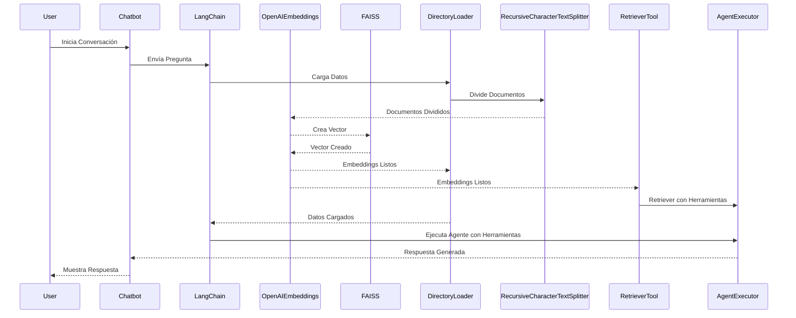

# 1. Documentación

## 1.1 Introducción

El objetivo de esta prueba (y de la existencia de este repositorio) es desarrollar y desplegar un asistente chatbot que utilice la arquitectura RAG para responder preguntas sobre el contenido del sitio web de Promptior, haciendo uso de la librería LangChain.

## 1.2 Descripción General del Proyecto

### 1.2.1 Objetivo del proyecto
Desarrollar un chatbot capaz de proporcionar respuestas basadas en la arquitectura RAG a preguntas específicas sobre los servicios ofrecidos por Promptior y la información de la empresa, utilizando la librería LangChain.

### 1.2.2 Funcionalidad
El chatbot debe ser capaz de responder preguntas como:
- ¿Qué servicios ofrece Promptior?
- ¿Cuándo fue fundada la empresa?

### 1.2.3 Tecnologías Utilizadas
- LangChain y LangServe: Implementación de la solución con LangChain, haciendo uso de LangServe para facilitar el desarrollo y despliegue.
- OpenAI: Utilización de la API de OpenAI para modelos generativos

### 1.2.4 Despliegue
La solución fue desplegada utilizando Azure:  
Link a la instancia: https://promptior.whitegrass-0bb08d35.westus2.azurecontainerapps.io/agent/playground/

## 1.3 Principales Desafíos

### 1.3.1 Primera vez haciendo un chatbot
Fue mi primera vez reaizando una tarea así. Si bien tuve la oportunidad de cursar una materia llamada Inteligencia Artificial Generativa (en la cual muchos compañeros de clase realizaron chatbots como obligatorio final), por mi parte, entregué al un poco distinto consistiendo en la validación/verificación de LLMs. Considero que esa experiencia trabajando con LLMs, con las guías que fueron proporcionadas y con mi experiencia programando se hizo bastante llevadero y entretenido. 

### 1.3.2 WebBaseLoader no funcionaba
Desconozco el motivo, pero al seguir la guía y utilizar WebBaseLoader con la web de Promptior (y debuggear utilizando varios print) me aparecia que la información que estaba cargando era vacía. Por lo que decidí copiar y pegar la información que estaba allí (y también en la consigna de la prueba tecńica) y utilizar un DirectoryLoader con dichos archivos.

### 1.3.3 ¿Splittear?
Al haber cargado esos archivos markdown (que son 5 y no pesan casi nada) entré en duda de si era necesario hacer un split de los documentos o no. Tengo entendido que es recomendable cuando se cargan grande volumenes de datos para hacer mejores particiones. Al final hice splitts pero sin pasar ningún parámetro. Esto funciona pero pasa a buscar en todos los documentos en lugar de ir a alguno más especifico. 

### 1.3.4 Output
No pude encontrar una manera de que poder solo obtener el "output" del OpenAIFunctionsAgentOutputParser, en su lugar obtengo una especie de JSON gigantesco, pero que de todas maneras responde correctamente a las preguntas. Intente creando agentes customs y muchas otras opciones, pero no lo pude lograr.

### 1.3.5 Deploy en Azure
Tengo experiencia deployando utilizando AWS pero por alguna razón no me estaba reconociendo la tarjeta, tuve que optar por utilizar Azure. Instalar el azure-cli en linux fue un poco complicado porque toma tu distro para buscar en los repositories pero no tenía la de Linux Mint Vera, solo Jammy. Cambiando eso (hardcodeandolo) pude instalarlo. Luego el deployar fue bastante sencillo.

## 1.4 Evaluación de la Solución

Se logró implementar las dos funcionalidades solicitadas, utilizando langserve, la api de OpenAI y deployando con Azure

# 2. Diagramas

## 2.1 Diagrama de Secuencia

## 2.2 Diagrama de Componentes
Un diagrama de componentes describe los elementos que tienen presencia en tiempo de ejecución y su forma de interacción. La siguiente figura ilustra que componentes están presentes y también como se conectan entre sí.

